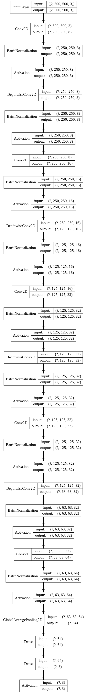

# lab2
Dataset: [AI-Lab-Makerere ibean](https://github.com/AI-Lab-Makerere/ibean/)  
Architecture: MobileNet-like  
[Google Colaboratory](https://colab.research.google.com/drive/19cWshQX2waa6TngvYv27w0zL0ftr6LjF?usp=sharing)

Input: 500 x 500 x 3  
Output: 3

Total params: 10,275  
Trainable params: 9,795  
Non-trainable params: 480  

Accuracy: 0.9141  

## Slides
* [Dataset](slides/Dataset.pdf)
* [MobileNet](slides/MobileNet.pdf)
* [Result](slides/Result.pdf)

## Architecture

