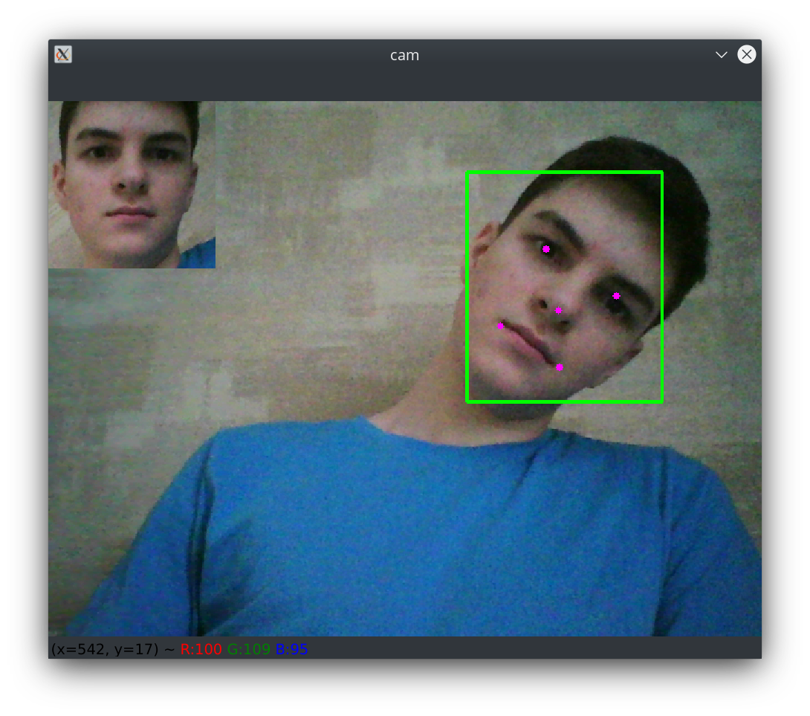
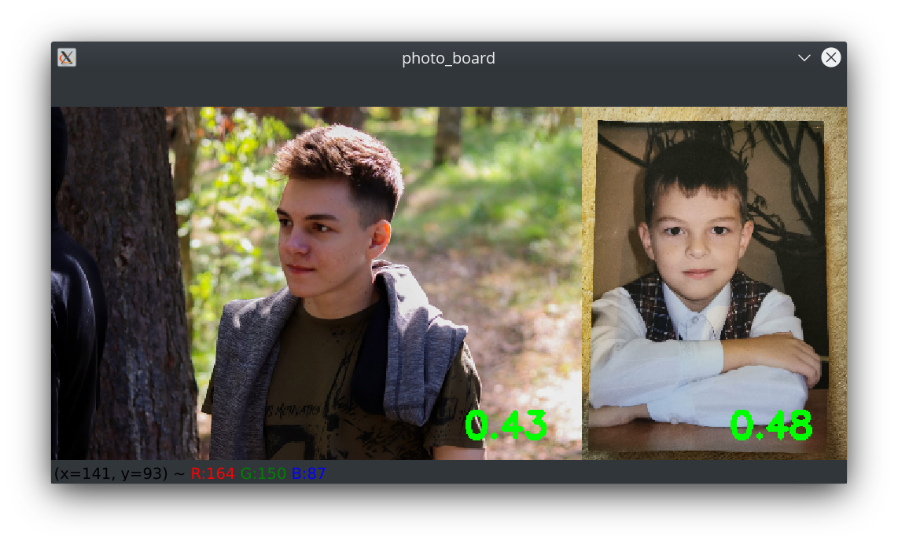

# lab3

## Вариант
Face detection - MTCNN  
 * [Статья на Хабре](https://habr.com/ru/company/rosbank/blog/511468/) (листать в конец)  

Face recognition - Dlib  
 * [Пример с комментариями](http://dlib.net/face_recognition.py.html)

## Результат
0.43 и 0.48 - расстояния Евклида между дескрипторами лиц с камеры и соответствующим фото.
<table>
    <tr>
        <td></td>
    </tr>
    <tr>
        <td></td>
    </tr>
</table>
При использовании порога расстояния 0,6 модель dlib получает точность 99,38% по стандартному критерию распознавания лиц LFW, что сопоставимо с другими современными методами распознавания лиц по состоянию на февраль 2017 года.

## Запуск
Добавте фото 1.jpg и 2.jpg в корень проекта и подключите веб-камеру.

